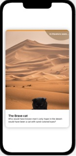

#  Cards in SwiftUI
Project shows how to create a card, one of the most common design elements in iOS apps. From 
the amazing tutorials at CodeWithChris.com: https://learn.codewithchris.com/courses/take/design/lessons/26070124-lesson-3-cards.

# Design

